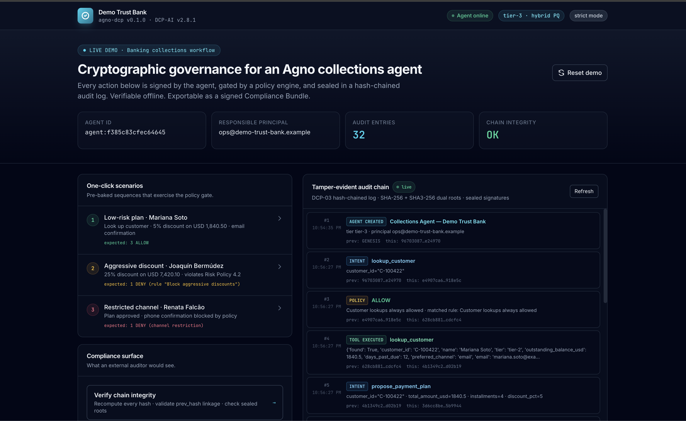

<div align="center">

# DCP-AI Banking Demo

**Cryptographic governance for production AI agents.**

A working reference implementation of identity, signed policy gating, and tamper-evident audit applied to an Agno-based collections workflow. Designed for evaluation by banks, fintechs, and regulated software teams.

[**▶ Open the live demo**](https://agno-dcp-demo.fly.dev) &nbsp;·&nbsp; [Source](https://github.com/dcp-ai-protocol/agno-dcp-demo) &nbsp;·&nbsp; [Protocol docs](https://docs.dcp-ai.org) &nbsp;·&nbsp; [agno-dcp on PyPI](https://pypi.org/project/agno-dcp/)

[](https://github.com/dcp-ai-protocol/agno-dcp-demo/actions/workflows/ci.yml)
[](LICENSE)
[](https://pypi.org/project/agno-dcp/)
[](https://www.python.org/)

</div>

---



## What this demonstrates

Every AI agent action shown in the dashboard above is:

- **Signed by the agent.** The agent carries a Citizenship Bundle bound to a named human principal (DCP-01). Ed25519 today; hybrid Ed25519 + ML-DSA-65 post-quantum at security tier 3 and above.
- **Gated by a policy engine.** Before each tool call the agent emits a signed Intent Declaration; the engine returns a signed Policy Decision (allow or deny + reason). Strict mode halts denied actions before they execute (DCP-02).
- **Sealed in a hash-chained audit log.** Every event is appended with `prev_hash` linkage and dual SHA-256 + SHA3-256 Merkle roots. Tamper with any historical entry and the chain breaks (DCP-03).
- **Independently verifiable.** A signed Compliance Bundle ZIP exports the entire audit trail with a per-framework mapping (EU AI Act or NIST AI RMF). External auditors validate the signature offline, without contacting the live system.

The demo runs a banking collections workflow (customer lookup, payment plan negotiation, channel-restricted communications) because regulated buyers can read it without explanation. The DCP-AI surface underneath is general purpose.

---

## Walkthrough

The hosted demo is read-only and replayable. Three pre-baked scenarios exercise the policy gate end to end.

| # | Scenario | Customer | Outcome |
|---|---|---|---|
| 1 | **Low-risk plan** | Mariana Soto | 5% discount on USD 1,840.50 — three approved actions |
| 2 | **Aggressive discount** | Joaquín Bermúdez | 25% discount triggers a deny under Risk Policy 4.2 |
| 3 | **Restricted channel** | Renata Falcão | Plan approved, phone confirmation blocked by policy |

Each scenario produces a live audit log (Server-Sent Events) showing every Intent, Policy Decision, and Tool Execution as it happens. Click **Verify chain integrity** to recompute every hash; click **Export bundle** to download a signed ZIP for an external auditor.

[Open the live demo](https://agno-dcp-demo.fly.dev) to step through it yourself.

---

## Capability comparison

| Capability                             | Agno alone           | Agno + agno-dcp                                    |
| -------------------------------------- | -------------------- | -------------------------------------------------- |
| Cryptographic agent identity           | Not provided         | Self-signed Citizenship Bundle (Ed25519)           |
| Pre-action policy enforcement          | Programmatic guards  | Declarative YAML rules with signed verdicts        |
| Tamper-evident audit                   | Standard logs        | Hash-chained, Merkle-sealed, offline-verifiable    |
| Inter-agent trust                      | JWT or app-level     | DCP-04 envelope: signed MCP messages               |
| EU AI Act mapping (Art. 12, 13, 14, 15, 50) | Bring your own  | Embedded in every Compliance Bundle                |
| NIST AI RMF mapping (Govern, Map, Measure, Manage) | Bring your own | Embedded in every Compliance Bundle             |
| Post-quantum readiness                 | Not addressed        | Ed25519 + ML-DSA-65 hybrid via DCP-AI v2.0         |

---

## Local development

```bash
git clone https://github.com/dcp-ai-protocol/agno-dcp-demo.git
cd agno-dcp-demo

python -m venv .venv && source .venv/bin/activate
pip install -e ".[dev]"

uvicorn app.main:app --reload
```

Open `http://localhost:8000`. No API keys required: the LLM provider defaults to a deterministic mock and the workflow is fully reproducible.

---

## Container deployment

```bash
docker compose -f docker/docker-compose.yml up --build
```

Persists the audit chain in a named Docker volume so restarts keep state.

---

## Production deployment to Fly.io

The hosted demo at [agno-dcp-demo.fly.dev](https://agno-dcp-demo.fly.dev) runs the same container documented in [`fly/README.md`](fly/README.md). Short version:

```bash
fly launch --copy-config --config fly/fly.toml --no-deploy --name <your-app-name>
fly volumes create agno_dcp_data --size 1 --region gru --app <your-app-name>
fly certs add demo.your-domain.example --app <your-app-name>
fly deploy --config fly/fly.toml
```

Update DNS, point a CNAME at `<your-app-name>.fly.dev`, and the cert auto-provisions. Total cost on the free tier is zero.

For automated redeploy on every push to `main`, add a `FLY_API_TOKEN` repository secret. The provided `.github/workflows/deploy.yml` handles the rest.

---

## What an audit entry looks like

Every gated action produces three signed events: `INTENT_DECLARED`, `POLICY_DECISION`, `TOOL_EXECUTED`.

```
#1  AGENT_CREATED   tier-3 · principal=ops@demo-trust-bank.example
#2  INTENT_DECLARED lookup_customer args={customer_id: C-100422}
#3  POLICY_DECISION ALLOW (rule: "Customer lookups always allowed")
#4  TOOL_EXECUTED   lookup_customer ok
#5  INTENT_DECLARED propose_payment_plan {discount_pct: 25, amount: 7420.10}
#6  POLICY_DECISION DENY (rule: "Block aggressive discounts (over 20%)")
                    reason: "Discounts above 20% require human approval per Risk Policy 4.2."
```

Each entry is hash-chained against the previous one. Tamper with any prior entry and the chain is provably broken at the first divergence.

---

## Verifying offline

Against the running container's database:

```bash
agno-dcp verify --sqlite ./app/data/agent.db
```

Or download a signed Compliance Bundle from the dashboard and ship it to your auditor. They run the bundled standalone verifier:

```bash
python scripts/verify_bundle.py compliance_eu_ai_act_*.zip
```

The verifier reads the manifest, recomputes the archive hash, and validates the embedded Ed25519 signature. It does not require network access. A valid signature confirms the bundle has not been altered since export.

---

## Architecture

```
┌──────────────────────────────────────────────────────────┐
│  Browser  (HTMX + Tailwind, no build step)               │
│  ├── one-click scenarios + custom tool runner            │
│  └── live audit log via Server-Sent Events               │
└─────────────────┬────────────────────────────────────────┘
                  │ HTTPS
┌─────────────────▼────────────────────────────────────────┐
│  FastAPI service                                         │
│  ├── POST /api/agent/run        run a single tool        │
│  ├── POST /api/agent/scenario   run a pre-baked flow     │
│  ├── GET  /api/audit/stream     SSE live entries         │
│  ├── GET  /api/audit/verify     offline verifier         │
│  └── POST /api/audit/export     signed Compliance ZIP    │
└─────────────────┬────────────────────────────────────────┘
                  │
┌─────────────────▼────────────────────────────────────────┐
│  agno-dcp wrappers around an Agno Agent                  │
│   DCP-01: Citizenship Bundle (Ed25519)                   │
│   DCP-02: signed IntentDeclaration + PolicyDecision      │
│   DCP-03: Merkle-sealed audit chain                      │
│   DCP-04: signed MCP envelopes (when inter-agent calls)  │
└─────────────────┬────────────────────────────────────────┘
                  │
┌─────────────────▼────────────────────────────────────────┐
│  Storage (SQLite on a persistent volume in production)   │
│   dcp_citizenship_bundles · dcp_intents                  │
│   dcp_policy_decisions · dcp_audit_chain · dcp_audit_roots
└──────────────────────────────────────────────────────────┘
```

The Compliance Bundle exporter walks the chain, embeds the relevant Citizenship Bundles, attaches the chosen framework mapping, signs the manifest with the audit chain's keypair, and outputs a portable ZIP.

---

## Customising for your environment

The demo is shaped to match a real deployment. Two files are designed to be edited:

### `app/policies.yaml` — declarative policy

```yaml
version: "1.0"
default: deny

rules:
  - name: "Limit large balances without escalation"
    when:
      action_type: tool_call
      tool_name: propose_payment_plan
      payload.total_amount_usd:
        gt: 5000
    then: deny
    reason: "Plans above USD 5,000 require Tier-3 risk officer cosign."
```

The matcher supports dotted paths (`payload.discount_pct`) and the operators `eq`, `ne`, `gt`, `gte`, `lt`, `lte`, `in`, `nin`. The first matching rule wins; otherwise `default` applies.

### `app/tools.py` — replace mocks with your real systems

Swap the four mock tools (`lookup_customer`, `propose_payment_plan`, `schedule_callback`, `send_confirmation`) for calls to your CRM, payment gateway, scheduler, and communications provider. The DCP-AI surface is unaffected: every tool keeps flowing through the same intent → policy → audit pipeline.

---

## Status and scope

| Field | Value |
|---|---|
| Version | `0.2.0` |
| Released | April 2026 |
| Suitable for | Sales demos, evaluation, internal pilots, regulated buyer discovery |
| Built on | [`agno-dcp`](https://pypi.org/project/agno-dcp/) `0.1.0` · [`dcp-ai`](https://pypi.org/project/dcp-ai/) `2.8.1` |
| Test coverage | Python 3.11 / 3.12 / 3.13 on Ubuntu, plus Docker build smoke |

### Not included in this release

The following are deliberately out of scope for the v0.2.0 demo:

- Live LLM inference (the workflow is deterministic; set `LLM_PROVIDER=anthropic|openai` plus an API key to swap in if needed for sales demos).
- Blockchain anchoring of Merkle roots (planned for `agno-dcp v0.3.0`).
- Multi-agent team scenarios with `DCPTeam` and signed inter-agent messaging.
- Hardware-backed key custody via AWS KMS, GCP Cloud KMS, or HashiCorp Vault.

---

## Repository layout

```
agno-dcp-demo/
├── app/
│   ├── agent.py             DCPAgent factory + lifecycle
│   ├── tools.py             mock CRM / payment / callback / email
│   ├── policies.yaml        declarative policy rules
│   ├── config.py            env-driven settings (pydantic-settings)
│   ├── main.py              FastAPI entry point
│   ├── routes/              /api/agent, /api/audit, /
│   ├── templates/           HTMX + Tailwind dashboard
│   └── static/              CSS + client-side JS
├── docker/                  Dockerfile + compose for local runs
├── fly/                     Fly.io deploy config + runbook
├── tests/                   pytest suite (agent + HTTP routes)
├── scripts/
│   └── verify_bundle.py     standalone offline bundle verifier
├── .github/workflows/       CI + auto-deploy on push to main
└── pyproject.toml
```

---

## DCP-AI ecosystem

This demo is one of three coordinated repositories. Pick the entry point that matches your role:

| Repo | Audience | Purpose |
|---|---|---|
| [`dcp-ai-protocol/dcp-ai`](https://github.com/dcp-ai-protocol/dcp-ai) | Protocol implementers | Reference protocol, JSON schemas, 5 SDKs (TypeScript, Python, Go, Rust, WASM), CLI, conformance harness |
| [`dcp-ai-protocol/agno-dcp`](https://github.com/dcp-ai-protocol/agno-dcp) | Python developers using Agno | Library that wraps Agno `Agent` / `Team` / `Workflow` / MCP primitives with DCP-AI governance |
| **`dcp-ai-protocol/agno-dcp-demo`** *(this repo)* | Regulated buyers, auditors | End-to-end banking demo: signed identity, gated tool calls, sealed audit log, signed Compliance Bundle |

Protocol spec, quickstarts, and compliance mappings live at [docs.dcp-ai.org](https://docs.dcp-ai.org). Project home page: [dcp-ai.org](https://dcp-ai.org).

---

## License and acknowledgments

Released under the [Apache License 2.0](LICENSE).

Built on:

- [Agno](https://www.agno.com/) — the Python agent framework.
- [`agno-dcp`](https://github.com/dcp-ai-protocol/agno-dcp) and [DCP-AI](https://dcp-ai.org/) — the cryptographic governance layer.
- [FastAPI](https://fastapi.tiangolo.com/), [HTMX](https://htmx.org/), [Tailwind CSS](https://tailwindcss.com/), and [SQLite](https://sqlite.org/).
